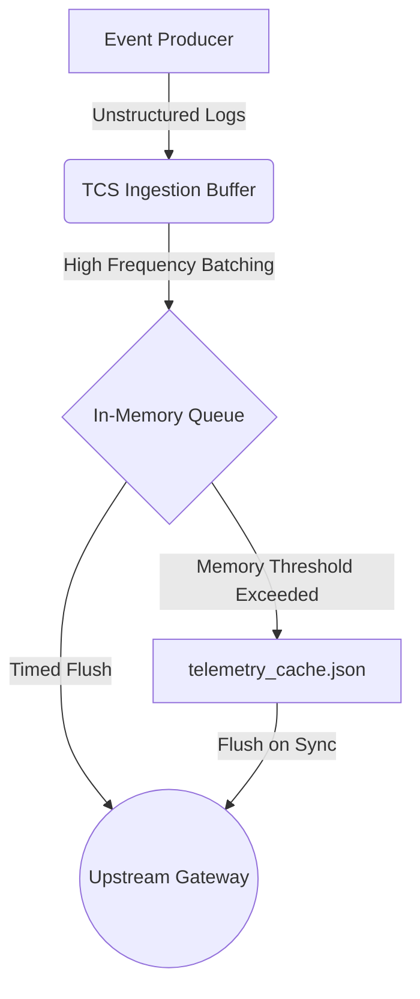

# Telemetry Cache Streamer (TCS)

An experimental, high-performance local daemon utility designed to buffer, throttle, and serialize system telemetry metrics before upstream ingestion. 

TCS operates as a local memory-to-disk spooler that prevents network overhead by batching high-frequency instrumentation events.

## Features

- **Asynchronous Serialization:** Low-latency batch serialization of process and network events.
- **Adaptive Backoff Queue:** Dynamically buffers logs when the ingestion gateway is unavailable.
- **Strict Size Bounds:** Prevents heap exhaustion by bounding memory buffers and swapping to a structured JSON file cache.
- **Jittered Dispatches:** Staggers network dispatches using random backoff times to prevent thundering herd conditions.

## Architecture



## Getting Started

### Prerequisites

- Unix-based operating system (Linux, macOS)
- CMake 3.15+
- GCC or Clang compiler supporting C++17

### Installation

Compile the daemon from source:

```bash
mkdir build && cd build
cmake ..
make
sudo make install
```

### Configuration

The daemon checks the local configuration directory for `tcs.conf`:

```json
{
  "buffer": {
    "max_memory_mb": 16,
    "flush_interval_seconds": 14400,
    "swap_file": "./telemetry_cache.json"
  },
  "transport": {
    "endpoint": "https://telemetry.local.internal/v2/ingest",
    "timeout_ms": 5000,
    "max_retries": 3
  }
}
```

## License

This project is licensed under the Apache 2.0 License - see the LICENSE file for details.
