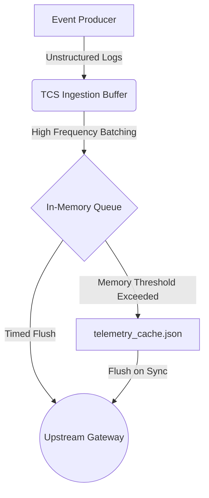

# Telemetry Cache Streamer (TCS)

[]()
[]()
[]()

An experimental, high-performance local daemon utility designed to buffer, throttle, and serialize system telemetry metrics before upstream ingestion. 

TCS operates as a local memory-to-disk spooler that prevents network overhead by batching high-frequency instrumentation events. It uses a thread-safe circular memory queue that flushes to a structured local JSON file swap buffer when size thresholds are exceeded or during periodic sync intervals.

## Features

- **Lock-Free/Low-Lock Buffering:** Thread-safe ingestion using minimal lock contention strategies (std::mutex protected circular queues).
- **Asynchronous Serialization:** Low-latency batch serialization of process and network events.
- **Adaptive Backoff Queue:** Dynamically buffers logs when the ingestion gateway is unavailable.
- **Strict Size Bounds:** Prevents heap exhaustion by bounding memory buffers and swapping to a structured JSON file cache (`telemetry_cache.json`).
- **Jittered Dispatches:** Staggers network dispatches using random backoff times to prevent thundering herd conditions on upstream ingestion services.

## Architecture



## Getting Started

### Prerequisites

- Unix-based operating system (Linux, macOS)
- CMake 3.15+
- GCC or Clang compiler supporting C++17
- Make build utility

### Compilation

Build the daemon from source using CMake:

```bash
# Clone the repository and navigate to build directory
mkdir -p build && cd build

# Generate build configuration
cmake -DCMAKE_BUILD_TYPE=Release ..

# Compile the executable
make

# Verify compile output
./tcs_daemon
```

### Installation

To install the daemon globally to your system:

```bash
sudo make install
```

## Configuration

TCS checks `/etc/tcs/tcs.json` or your local workspace directory for configuration files:

```json
{
  "buffer": {
    "max_memory_mb": 16,
    "flush_interval_seconds": 14400,
    "swap_file": "./telemetry_cache.json"
  },
  "transport": {
    "endpoint": "https://telemetry.local.internal/v2/ingest",
    "timeout_ms": 5000,
    "max_retries": 3
  }
}
```

## License

This project is licensed under the Apache 2.0 License - see the LICENSE file for details.
